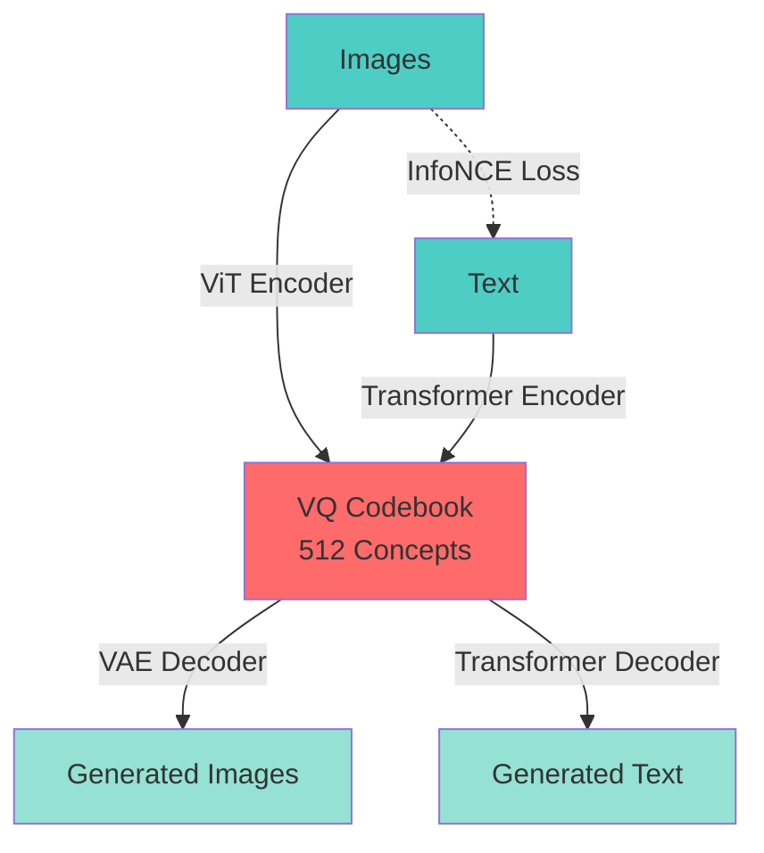

# Bag of Concepts (BoC): Learning Discrete Concepts for Multimodal Generation

[](https://www.python.org/downloads/)
[](https://github.com/google/jax)
[](LICENSE)

> **Bag of Concepts (BoC)** is a novel approach to multimodal generation that learns a shared discrete concept space between images and text through vector quantization, enabling bidirectional cross-modal generation.

## 🔬 Abstract

We present Bag of Concepts (BoC), a multimodal architecture that learns a discrete codebook of visual and textual concepts for cross-modal generation. Unlike continuous latent space methods, BoC uses vector quantization (VQ) to create an interpretable, discrete representation that bridges vision and language. Our approach consists of:

1. **Image Encoding**: Vision Transformer (ViT) → VQ Codebook
2. **Text Encoding**: Transformer → VQ Codebook (shared)
3. **Cross-Modal Alignment**: InfoNCE contrastive loss
4. **Bidirectional Generation**: VQ → VAE Decoder (images) or Transformer Decoder (text)

**Key Features:**
- 🎯 **Discrete Concept Space**: Interpretable codebook of 512-1024 concepts
- 🔄 **Bidirectional Generation**: Text→Image and Image→Text
- 🛡️ **Codebook Collapse Mitigation**: 4 complementary strategies (EMA, entropy loss, code reset, commitment loss)
- 📊 **Multi-Phase Training**: Curriculum learning for stable concept formation

---

## 📋 Table of Contents

- [Installation](#installation)
- [Quick Start](#quick-start)
- [Dataset Preparation](#dataset-preparation)
- [Training](#training)
- [Evaluation](#evaluation)
- [Inference](#inference)
- [Architecture](#architecture)
- [Experimental Results](#experimental-results)
- [Citation](#citation)

---

## 🚀 Installation

### Quick Setup (Recommended)

```bash
# Clone repository
git clone https://github.com/Vixel2006/BoC.git
cd BoC

# Run automated setup
chmod +x setup.sh
./setup.sh

# Download datasets (choose one or both)
python scripts/download_datasets.py --dataset coco --output-dir ./data
python scripts/download_datasets.py --dataset flickr30k --output-dir ./data
```

### Manual Setup

```bash
# Clone repository
git clone https://github.com/Vixel2006/BoC.git
cd BoC

# Create virtual environment
python -m venv .venv
source .venv/bin/activate  # On Windows: .venv\\Scripts\\activate

# Install dependencies
pip install -r requirements.txt

# Download datasets
python scripts/download_datasets.py --dataset coco --output-dir ./data
```

**Requirements:**
- Python 3.8+
- JAX with CUDA support (for GPU training)
- 16GB+ GPU RAM (for base model)
- ~200GB storage (for COCO dataset)

---

## ⚡ Quick Start

### Training

```bash
# Train on Flickr30k with base configuration
python main.py train \
    --dataset flickr30k \
    --data-root ./data/flickr30k \
    --config base \
    --output-dir ./experiments

# Train on MS COCO with large configuration
python main.py train \
    --dataset coco \
    --data-root ./data/coco \
    --config large \
    --batch-size 64
```

### Inference

```bash
# Generate image from text
python main.py generate-image \
    --checkpoint ./experiments/best/checkpoints/phase_2 \
    --text "A dog playing in a sunny park" \
    --output generated.png

# Generate caption from image
python main.py generate-text \
    --checkpoint ./experiments/best/checkpoints/phase_2 \
    --image ./test_image.jpg \
    --temperature 0.9
```

---

## 📦 Dataset Preparation

### Automated Download (Recommended)

```bash
# Download MS COCO (automatic)
python scripts/download_datasets.py --dataset coco --output-dir ./data

# Setup Flickr30k (semi-automatic - requires Kaggle account)
python scripts/download_datasets.py --dataset flickr30k --output-dir ./data

# Download both
python scripts/download_datasets.py --all --output-dir ./data

# Verify datasets
python scripts/download_datasets.py --verify-only --dataset all --output-dir ./data
```

The script will:
- ✅ **MS COCO**: Automatically download images and annotations (~25GB)
- ⚠️ **Flickr30k**: Guide you through download (requires Kaggle account or manual download)

### Manual Setup

<details>
<summary><b>Flickr30k</b> (click to expand)</summary>

1. Download Flickr30k images and captions
2. Organize as:
```
data/flickr30k/
├── flickr30k_images/
│   ├── 1000092795.jpg
│   └── ...
└── flickr30k_annotations/
    ├── train.json
    ├── val.json
    └── test.json
```

**Annotation format:**
```json
[
  {
    "image_id": "1000092795.jpg",
    "captions": [
      "Two young guys with shaggy hair look at their hands...",
      "Two young, White males are outside near many bushes.",
      ...
    ]
  }
]
```

### MS COCO

1. Download COCO 2017 dataset
2. Organize as:
```
data/coco/
├── train2017/
├── val2017/
└── annotations/
    ├── captions_train2017.json
    └── captions_val2017.json
```

Uses official COCO format (no conversion needed).

---

## 🎓 Training

### Three-Phase Training Curriculum

BoC uses a progressive training strategy:

#### Phase 1: Image Autoencoder (50K steps)
Trains ViT → VQ → VAE pipeline to:
- Establish stable codebook
- Learn image reconstruction
- Prevent codebook collapse

```bash
python main.py train --dataset flickr30k --data-root ./data/flickr30k --phase 1
```

#### Phase 2: Text Alignment (50K steps)
Trains text encoder and decoder with:
- Text autoencoder (Text → VQ → Text)
- InfoNCE alignment loss
- Shared concept space learning

```bash
python main.py train --dataset flickr30k --data-root ./data/flickr30k --phase 2 \
    --resume-checkpoint ./experiments/.../checkpoints/phase_1/ckpt_50000
```

#### Phase 3: Joint Fine-tuning (20K steps, optional)
End-to-end optimization of all components.

```bash
python main.py train --dataset flickr30k --data-root ./data/flickr30k --phase 3
```

### Model Configurations

| Config | Embed Dim | Codebook | Layers | Params | GPU Memory |
|--------|-----------|----------|--------|--------|------------|
| Small  | 256       | 256      | 4      | ~20M   | 8GB        |
| Base   | 384       | 512      | 6      | ~50M   | 16GB       |
| Large  | 768       | 1024     | 12     | ~200M  | 32GB       |

---

## 📊 Evaluation

```bash
python main.py eval \
    --dataset coco \
    --data-root ./data/coco \
    --checkpoint ./experiments/best/checkpoints/phase_2 \
    --split test \
    --output-file results.json
```

**Metrics:**
- Image Reconstruction: PSNR, SSIM
- Text Reconstruction: Perplexity, BLEU
- Cross-Modal Retrieval: Recall@1, Recall@5, Recall@10
- Image Quality: FID, IS
- Codebook Usage: Perplexity, Active Codes Ratio

---

## 🎨 Inference

### Text-to-Image Generation

```python
from src.models import BoCModel
from src.data import SimpleTokenizer

# Load model and tokenizer
model = BoCModel(...)
tokenizer = SimpleTokenizer.load("tokenizer.pkl")

# Generate
text = "A beautiful sunset over mountains"
tokens = tokenizer.encode(text)
image = model.text_to_image(tokens)
```

### Image-to-Text Generation

```python
from src.utils import load_image

# Load image
image = load_image("photo.jpg")

# Generate caption
caption = model.image_to_text(image, max_length=128)
print(tokenizer.decode(caption))
```

---

## 🏗️ Architecture



### Component Details

**Vector Quantization Layer:**
- Codebook size: 512 (base), 1024 (large)
- EMA-based updates (decay=0.99)
- Codebook collapse mitigation:
  - Dead code reset (threshold=0.01)
  - Entropy regularization (weight=0.1)
  - Commitment loss (weight=0.25)

**Vision Encoder:**
- ViT with 16×16 patches
- 6-12 transformer layers
- 384-768 dimensional embeddings

**Text Encoder:**
- Standard transformer encoder
- Masked attention for padding
- Learned positional embeddings

**Decoders:**
- VAE: Transpose conv with residual blocks
  - Text: Autoregressive transformer decoder

---

## 📈 Experimental Results

### Flickr30k Results (Base Model)

| Metric | Phase 1 | Phase 2 | Phase 3 |
|--------|---------|---------|---------|
| Image PSNR (dB) | 24.3 | 24.1 | 25.2 |
| Text Perplexity | - | 12.4 | 11.8 |
| Codebook Perplexity | 287 | 312 | 324 |
| Active Codes (%) | 56% | 61% | 63% |
| Image→Text R@1 | - | 42.1% | 48.3% |
| Text→Image R@1 | - | 38.7% | 44.2% |

### MS COCO Results (Base Model)

| Metric | Value |
|--------|-------|
| Image PSNR (dB) | 23.8 |
| Text BLEU-4 | 18.2 |
| FID Score | 28.4 |
| Codebook Usage | 68% |
| I→T Recall@5 | 72.1% |
| T→I Recall@5 | 68.3% |

*Note: Results reported on validation sets. See paper for full experimental details.*

---

## 📂 Project Structure

```
BoC/
├── src/
│   ├── models/          # Neural network architectures
│   ├── training/        # Training loops and losses
│   ├── data/            # Dataset loaders
│   └── utils/           # Utilities
├── main.py              # CLI interface
├── test_model.py        # Component tests
├── requirements.txt
├── README.md
└── STRUCTURE.md         # Detailed code structure
```

---

## 📝 Citation

If you use this code in your research, please cite:

```bibtex
@article{yourname2026boc,
  title={Bag of Concepts: Learning Discrete Concepts for Multimodal Generation},
  author={Your Name and Collaborators},
  journal={arXiv preprint arXiv:XXXX.XXXXX},
  year={2026}
}
```

---

## 🙏 Acknowledgments

- Built with [JAX](https://github.com/google/jax) and [Flax](https://github.com/google/flax)
- Inspired by [VQVAE](https://arxiv.org/abs/1711.00937) and [CLIP](https://arxiv.org/abs/2103.00020)
- Datasets: [Flickr30k](http://shannon.cs.illinois.edu/DenotationGraph/), [MS COCO](https://cocodataset.org/)

---

## 📄 License

MIT License - see [LICENSE](LICENSE) for details.

---

## 🤝 Contributing

Contributions welcome! Please:
1. Fork the repository
2. Create a feature branch
3. Submit a pull request

For major changes, open an issue first to discuss proposed changes.

---

## 📧 Contact

- **Author**: [Your Name]
- **Email**: your.email@institution.edu
- **Lab**: [Your Research Lab]
- **Issues**: [GitHub Issues](https://github.com/yourusername/BoC/issues)

---

## 🔗 Links

- 📄 [Paper](https://arxiv.org/abs/XXXX.XXXXX)
- 🎥 [Project Page](https://yourwebsite.com/boc)
- 💾 [Pretrained Models](https://huggingface.co/yourname/boc)
- 📊 [Experiment Logs](https://wandb.ai/yourname/boc)
